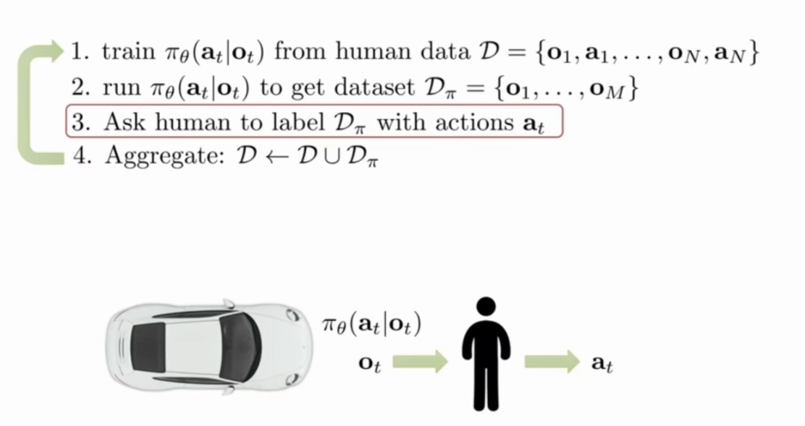
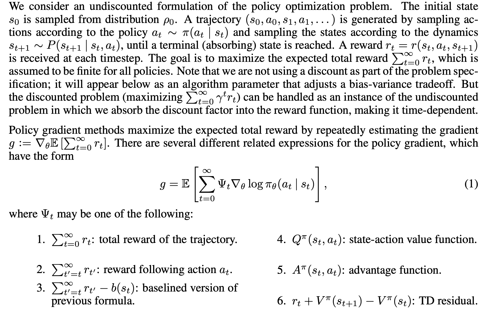

强化学习，有监督和无监督学习的区别：

1.有监督学习关心的是要优化与真实目标的误差，强化学习中的优化的真实目标往往是动态的，模糊的，往往是通过最大化奖励来行动。

2.无监督学习是无反馈的训练，而强化学习中能够能够得到执行多步之后的反馈(Reward)。

模仿学习的问题：[复习链接](https://blog.csdn.net/zyh19980527/article/details/115448808)

人类采样得到的数据分布可能不是策略本身生成的分布，因为策略得到的观察和人类（克隆）可能存在问题，Dagger  让策略网络生成观察，然后**人工标记动作**，当然如果加上人类有意去靠近agent的行为数据的话有更多符合agent分布的数据，这样能够解决分布和人类行为分布不一致的问题（这也是DAgger算法流程）。

利用传统的学习一个监督学习的方式来做预测不适用于序列决策的过程，因为当前时刻的过程会影响后续时刻的状态，（非模特卡罗）不是独立同分布的，比如说把自动驾驶系统里的一帧图片(obs)很难去判断下一步采取的行动，因为即使是同一个观察，动作也是可能不一样的，所以我们使用多个过去的数据来处理。可以用RNN或者LSTM去提取时序信息，也就是把obs提取成状态。

另一些问题就是网络无法理解因果性和misture的问题

DQN和AC的区别：

[转载](https://www.zhihu.com/question/358322675?msclkid=bed10a28b58411ecb357410dbdc5a99d)：也可以从离散动作本身的维度来考虑. 通常DQN处理几维到十几维的动作的performance和sample efficiency是好于actor-critic, 但是如果是几十上百维的动作,那actor-critic配上categorical distribution可能更适合.

on-policy 和 off-policy的区别。

函数平滑可微。

利用非线性的函数估计比如神经网络会造成两个主要问题，第一个就是很难得到一个稳定的提升，因为数据的不平稳的。第二个就是样本需求很大。

动作和他的奖励的反馈很长：

A key source of difficulty is the long time delay between actions and their positive or negative effect on rewards; this issue is called the credit assignment problem in the reinforcement learning literature (Minsky, 1961; Sutton & Barto, 1998), and the distal reward problem in the behavioral literature (Hull, 1943). 

TD 、MC 、DP 的区别：

DP是有模型的学习，它利用整个采样的样本分布，$P(s'|s,a)$ 。

MC、TD采用的是无模型的学习，采用的是上一次样本的分布，Bootstraping，MC反应的是与真实结束的误差，MC要整个轨迹都采样完之后采会进行估计，TD 每一步都会进行估计，并且也能保证收敛，只要step-size足够小并且满足:$\sum a_k (a) = \inf \ and \ \sum \alpha^2_k(a) < \inf $  。

从数学上看，MC目标是最小化样本集的均方误差$V(s) = V(s) + \alpha(G - V(s))$，TD 目标是逼近基于样本集的似然估计。

 TD 在实践上更快一些。

Actor-critic 使用值函数而不是经验回报，引入一些偏差来减小方差，但是偏差会让算法不收敛，方差大的解决方法是引入更多的样本。

减少训练样本方差的方法： 引入Discount $\gamma$和关于$S_i$的基准函数比如$ V (s)$ 来降低未来的权重以减少奖励随机性的指数级积累。

TRPO 的出发背景是由于DQN和策略梯度这样的方法存在两个问题，即A3C和PG优化的是一个参数空间，参数的变化对策略在性能上造成一个很大的差异，也就是说参数空间不是策略空间的一个线性变换，步长的大小不直接反应在奖励函数的曲面上，一个错误的步骤可能会导致一系列策略的失败，因此我们应该直接对策略的性能进行优化:$V_{\pi'}(s) = V_\pi(s) + E_{\tau -\pi' } (\sum (\gamma^t A(s,a)))$

如何避免新策略与旧策略相差太大？ KL散度衡量，当KL超过某个threshold 的时候就early stopping。

**为什么需要拆分成目标网络和旧网络。**

由于在更新网络参数的时候，利用监督学习的方法来做更新，真实值利用的是估计值（例如TD error, 有偏差的MC, reward to go, $\lambda$步TD等），因此会带来误差，更新网络参数后策略改变会比较大，导致策略不稳定，因此要用两个网络，让网络的变化不能太大(soft update 设定一个超参数来更新网络)，不相关的噪声之间可能会抵消，所以一般我们会用Double DQN来做实验。

**如何证明$Q = E (r + y maxQ^* (s' ,a '))$**

观察Backup 树可以发现一个事实就是V(S)实际上是$V(s) = E(Q(s,a))$ ，因此我们选择能够奖励更大的动作使得$V = max E(Q(s',a'))$，最大化$\pi $则有 $V = max E(Q^*(s',a'))$,因此$V^* = max E (Q^*(s',a'))$ , 由于$V* = E(r + V^*(s'))$ ，代入 $V^*(s')$就可以得到$Q = E (r + y maxQ^* (s' ,a '))$

一些总结：

首先environment给出一个initial state，然后agent根据state给出action，environment接受这个action，根据model给出reward以及next state，agent进一步作出决策，如此往复循环。而RL的objective就是要找到一组参数，最大化所有trajectory上能获得的总和：引入了policy gradient系列的方法，直接对这个objective关于参数做gradient，并进行梯度下降，而value based的方法则是通过找到每个state能够获得最大期望reward的action，从而得到policy。而actor-critic方法则是结合两者，将value function 引入policy gradient中降低variance。

open loop planning 和 close loop 的区别：

可以直观想就是open loop让 agent 停下来"思考"一下...[具体参考](https://zhuanlan.zhihu.com/p/101348045)

规划（planning）：表示任何以环境作为输入来提升或生成与环境进行交互的策略的计算过程。
