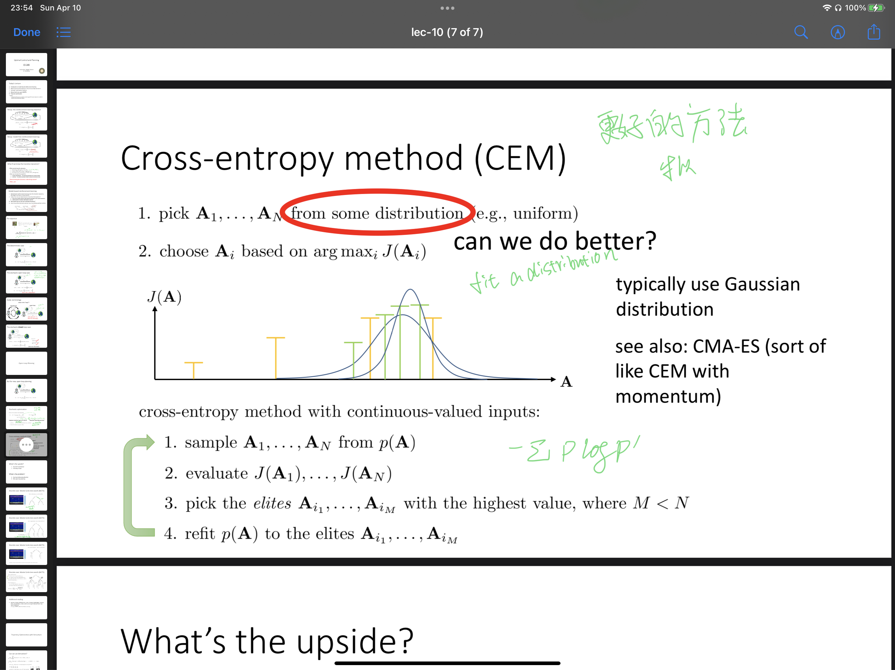

## 这里会记录一些发现自己理解不够透彻的知识点

1. 需要阅读的GAE [Schulman, John, et al. &#34;High-dimensional continuous control using generalized advantage estimation.&#34; arXiv preprint arXiv:1506.02438 (2015).](http://link.zhihu.com/?target=https%3A//arxiv.org/pdf/1506.02438)


Eligibility Traces :  一种用来评估状态记忆的工具，每一步(step)的时候我们都会评估所有的状态，如果访问到该状态，那么就会这个状态的影响程度就会加深，如果没有访问到这个状态，一般来说会discount这个值。Eligibility Trace 会影响V(S)的更新，比如说TD($\lambda$)的增量一般写成$\Delta V_t(s) = \alpha (R_{t+1} + \lambda V_t(S_{t +1}') - V_t(S_t)) E_t(s)$, 其中$E_t(s)$Eligibility Trace:

$E(s_0) = 0, \\E(S_t) = E(S_t)+1\\ E(s) = \gamma\lambda E_{t-1}(s)$

这样评估V(s)的方法称为backward view，“backward和forward是一致的”（为什么一样我不知道），后向TD($\lambda$)旨在通过设定权重（例如程度,书上笔记）来为已经观察过的状态分配奖励。forward view 的方法是 n step return方法作轨迹上的平均，被称为$\lambda - return \ algorithm$ .

back-view 的gradient-descent 不是很懂（9.5）p231：

 $w_{t+1} = w_t + \alpha \delta_t e_t$

Prioritize sweep 是一种用来加速采样效率的方法，对于model-based的方法而言，有一个planning的过程是通过模拟环境来得到一些经验数据$ ( Model(S,A) \rightarrow S',R)$ ，用以进行值函数的更新。例如Q-plannning 方法就是每一个step进行更新的时候都会随机地采样观察过的S和对应的A，得到S',R之后利用来更新Q函数（Determinate）。这样的好处之一是当环境发生改变时，Model 的更新就能够很快地发现和纠正旧Q值的大小。进而Prioritize Sweep的出现是来解决采样效率过于平均的问题，因为当环境改变的时候往往只改变某一部分的状态，这时候更新一些相关性不强的状态值变化很小几乎没有必要， 所以Priority Sweep 的做法是：

Linear Method ：P233 为什么需要编码的原因：

（原文）In general, we also need features for combinations of these natural qualities. This is because the linear form prohibits the representation of interactions between features, such as the presence of feature i being good only in the absence of feature j. For example, in the pole-balancing task (Example 3.4), a high angular velocity may be either good or bad depending on the angular position. If the angle is high, then high angular velocity means an imminent danger of falling, a bad state, whereas if the angle is low, then high angular velocity means the pole is righting itself, a good state. In cases with such interactions one needs to introduce features for conjunctions of feature values when using linear function approximation methods. We next consider some general ways of doing this.

疑问点，意思是说如果Features来线性表示状态的话需要Feature之间互不相关吗？

在连续动作空间中如何使用DQN？

1种方法是先采样动作空间A, 然后我们在有限的集合中选择$max(Q(s',a1),Q(s',a2),Q(s',a3)..)$

另一种方法是用NAF，比如使用一个能够求出最大值对应点的（例如正态分布最高值容易得到平均值）的函数来近似Q(s,a)

Ornstein-Uhlenbech process怎么理解，是用来做探索的，功能是在生成的行为基础上添加一个随机噪声，使其在确切的行为周围实现一定范围的探索。

[一种较合理的初始化网络参数：](https://arxiv.org/abs/1502.01852)

```python
def fanin_init(size, fanin=None):
  fanin = fanin or size[0]
  v = 1. / np.sqrt(fanin)
  x = torch.Tensor(size).uniform_(-v, v) # 从-v到v的 均 匀 分 布 return x.type(torch.FloatTensor)
  
```

在实际的应用场景中应该如何定义状态奖励价值函数，例如自动驾驶。

**区分MCTS与 A* 的应用场景：**一种角度，$A^*$算法明确了目标的信息之后利用启发函数去搜索到达目标的轨迹，而MCTS则通过不断试错和最大化奖励为目的是搜索到达目标的轨迹。另外，MCTS 是适用在一个随机推测的过程，有举例子就是说$A^*$是在这个确定的图网络下进行的搜索，如果是想打扑克这样的无法预知下一个动作的话，MCTS来求解更加合适。

Cross Entropy Method，CEM方法对Stochastic Optimization的改进，用于拟合一个概率分布（例如Guass），这个分布可以用来对A这个动作空间进行采样，然后估计$J(A_i)$ 选取最大值。(CMA-ES 是一个改进版)，**问题是具体怎么实现呢？**


